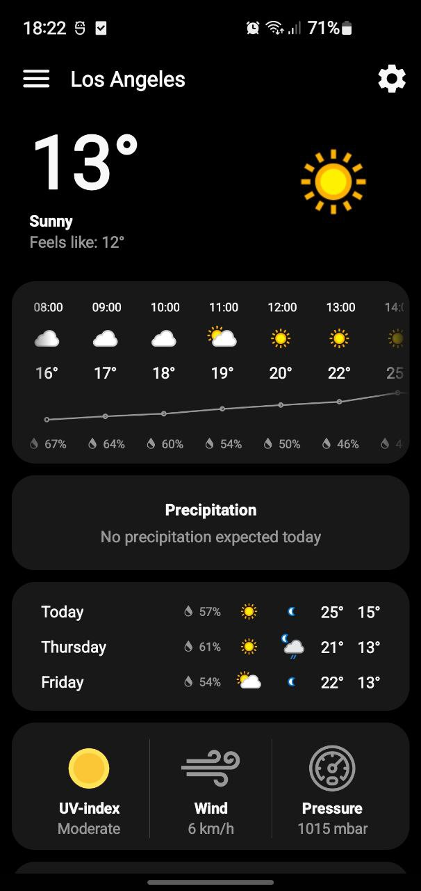
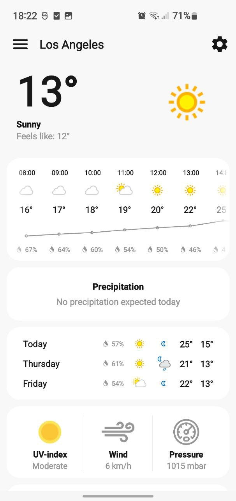
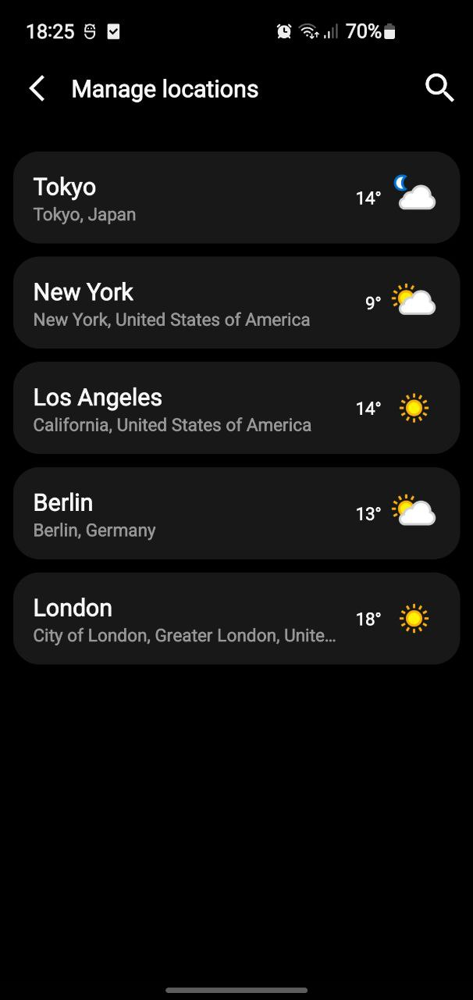
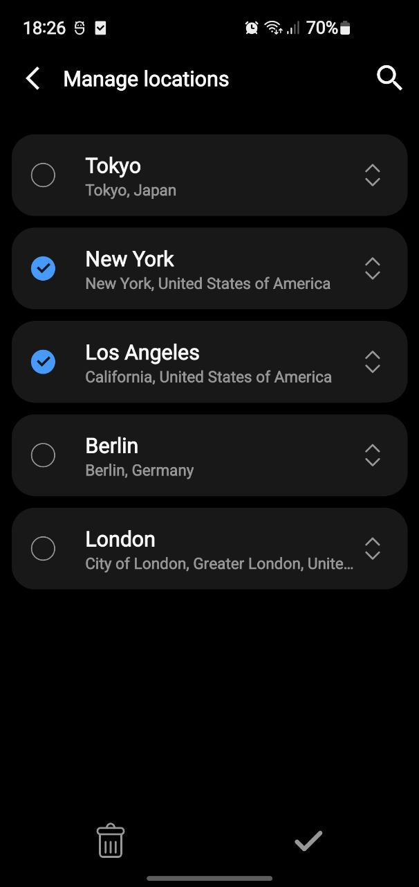
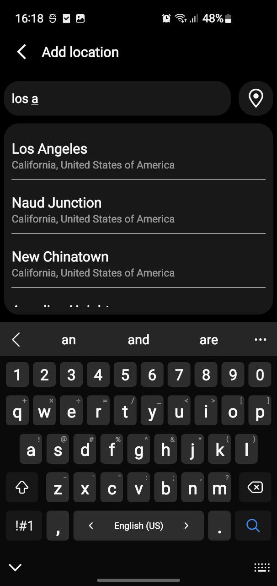
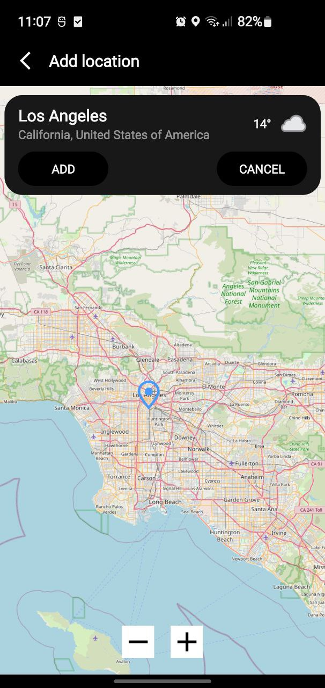
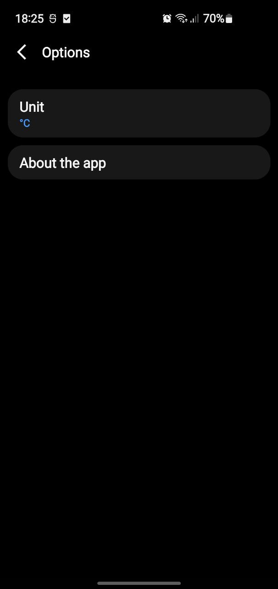

# Weather app
Погодное приложение для Android

## Сборка и запуск
Для того что бы собрать проект необходимо в корне проекта создать файл app.properties (по аналогии с .app.properties)и указать в поле weatherApiKey ключ для доступа к апи

Ключ можно бесплатно получить зарегистрировавшись на https://www.weatherapi.com/

## Функионал:
* отображение текущей погоды
* почасовой прогноз на ближайшие 24 часа
* прогноз на 3 дня
* уведомления о погодных событиях в ближайшие 24 часа
* данные о качестве воздуха
* добавление и управление локациями
* возможность выбрать единицу измерения температуры(°С/°F)

## Стек технологий
* код написан на Kotlin
* MVVM
* навигация - Jetpack Navigation  
* для асинхронных операций - Coroutines
* сетевое взаимодействие - OkHttp, Retrofit
* доступ к БД - Room
* DI - Dagger2
* карта - OpenStreetMap

## Скриншоты
 
  
 
 
